# CRM ORM/ODM Lab

API REST de un CRM básico que combina un ORM (Sequelize + PostgreSQL) y un ODM (Mongoose + MongoDB).

## Stack

- Node.js 22, Express 5, CommonJS
- Sequelize + PostgreSQL 16 (`User`, `Company`, `Contact`)
- Mongoose + MongoDB 7 (`Activity`)
- Jest + Supertest
- GitHub Codespaces, Dev Containers, Docker Compose
- Supervisor (`npm run dev`)

## Arquitectura

```text
GitHub Codespace
│
├── app       Node.js 22  ──┬── Sequelize ──> postgres (PostgreSQL)
│                           └── Mongoose  ──> mongo    (MongoDB)
├── postgres
└── mongo
```

La aplicación se conecta por nombre de servicio (`postgres`, `mongo`). Las credenciales de desarrollo llegan como variables de entorno definidas en `.devcontainer/docker-compose.yml` (ver `.env.example`).

## Iniciar el Codespace

1. En GitHub: **Code → Codespaces → Create codespace on main**.
2. Espera a que se levanten los tres servicios (`app`, `postgres`, `mongo`). `postCreateCommand` ejecuta `npm install`.

## Instalar dependencias

```bash
npm install
```

## Seed y reset

```bash
npm run seed    # inserta datos deterministas (3 users, 4 companies, 8 contacts, 10 activities)
npm run reset   # elimina y recrea tablas/base de datos y vuelve a sembrar
```

## Iniciar la API

```bash
npm start       # node ./bin/www
npm run dev     # supervisor ./bin/www
```

Servidor en el puerto `3000` (variable `PORT`).

## Pruebas

```bash
npm test
```

Cada suite restablece PostgreSQL y MongoDB antes de ejecutarse y cierra las conexiones al terminar.

## Endpoints

| Método | Ruta | Descripción |
|---|---|---|
| GET | `/health` | Health check |
| GET | `/users` | Listar usuarios |
| GET | `/users/:id` | Obtener usuario |
| POST | `/users` | Crear usuario |
| PUT | `/users/:id` | Actualizar usuario |
| DELETE | `/users/:id` | Eliminar usuario |
| GET | `/companies` | Listar compañías (`?industry=`) |
| GET | `/companies/:id` | Obtener compañía |
| POST | `/companies` | Crear compañía |
| PUT | `/companies/:id` | Actualizar compañía |
| DELETE | `/companies/:id` | Eliminar compañía |
| GET | `/contacts` | Listar contactos |
| GET | `/contacts/:id` | Obtener contacto |
| POST | `/contacts` | Crear contacto |
| PUT | `/contacts/:id` | Actualizar contacto |
| DELETE | `/contacts/:id` | Eliminar contacto |
| GET | `/activities` | Listar actividades (`?type=`) |
| GET | `/activities/:id` | Obtener actividad |
| POST | `/activities` | Crear actividad |
| PUT | `/activities/:id` | Actualizar actividad |
| DELETE | `/activities/:id` | Eliminar actividad |

Los errores se devuelven como JSON: `{ "error": "Contact not found" }`.
## Respuestas
**1.Dos motores**: Una base documental es para tener documentos flexibles, pueden tener estructuras distintas entre sí, incluso si están en la misma colección. Entonces, en Activity puede tener dos documentos, pero con su campo de metadata distinta, porque eso cambia dependiendo su tipo de actividad, es por eso que Activity es buen candidato para una base documental, porque su campo metadata cambia según su tipo y así ya no es necesario hacer columnas fijas. Luego tenemos la base relacional que, a comparación de la documental, es muy estricta. Aquí los datos viven dentro de tablas con columnas fijas, es por eso que Company y Contact son buenos candidatos para una base relacional, porque su estructura siempre es la misma y tienen una relación entre ellos (una compañía tiene muchos contactos).

**2.ORM vs ODM**: El ORM es el que traduce un objeto a tablas relacionales, la librería que usamos en este proyecto es Sequelize. Y un ODM traduce un objeto a documentos de una base NoSQL, y aquí la librería que usamos es Mongoose. La principal diferencia es que Sequelize trabaja con esquemas rígidos y tablas relacionales y Mongoose trabaja con esquemas más flexibles.

**3.Configuración por variables de entorno**:Las credenciales de las bases de datos se definen en .env.example en donde encontramos:
```bash
PORT=3000
NODE_ENV=development

# PostgreSQL (Sequelize)
DB_HOST=postgres
DB_PORT=5432
DB_NAME=crm
DB_USER=crm
DB_PASSWORD=crm
# MongoDB (Mongoose)
MONGODB_URI=mongodb://mongo:27017/crm
```
La razón por lo que no los escribimos dentro de los archivos .js es porque quedarían súper expuestas al subirlo al repositorio en GitHub y cualquiera que entre va a poder ver tanto el usuario y contraseña de nuestra base de datos.
Ahora la razón por lo que no se usa localhost es porque cada servidor tiene su propio contenedor y se conectan entre sí usando el nombre de servicio definido, por ejemplo ****MONGODB_URI=mongodb://mongo:27017/crm**** mongo es el nombre del contenedor pero está dentro de la misma red Docker, eso mismo pasa con DB_HOST.

**4.Asociaciones**: En models/
sequelize/index.js. tenemos:
```bash
// Company 1 --- N Contact
Company.hasMany(Contact, { foreignKey: 'companyId', as: 'contacts', onDelete: 'CASCADE' });
Contact.belongsTo(Company, { foreignKey: 'companyId', as: 'company' });

```
Aquí se define una relación 1 a N, esto quiere decir que una compañía puede tener muchos contactos. Ahí mismo nos dice que su foreignKey es companyId y esa llave foránea vive en la tabla Contact, el alias 'contacts' sirve para nombrar esa relación específica al hacer consultas.

**5.Eager loading**:Si lo hacemos uno por uno estaríamos esperando demasiado o estaríamos haciendo como viajes innecesarios, porque primero le preguntamos que nos dé la compañía, nos esperamos y nos la da, y luego le volvemos a decir que ahora nos dé sus contactos, entonces hacemos dos consultas. En cambio, si usamos include con eager loading le pedimos todo de una vez, que nos dé la compañía y también sus contactos y nos lo da todo de una vez. Entonces sí es mejor usar el eager loading con include cuando sabemos que vamos a necesitar dos datos relacionados, así sería menos código y más simple.

**6.Instancia vs consulta**:En buscar con el update() nos regresa el objeto completo ya actualizado y con sus campos, pero este necesita hacer dos viajes a la base de datos, uno para buscar y otro para guardar, si usamos Model.update solo nos regresaría un número de cuántas filas fueron modificadas y solo haría un viaje a la base de datos. Entonces, si queremos devolver el objeto actualizado como respuesta es mejor usar el .update(), pero si solo queremos hacer el cambio rápido podemos usar Model.update.

**7.Esquema flexible**:En models/mongoose/
activity.js podemos ver que el tipo de dato que usa para metadata que es mongoose.Schema.Types.Mixed = Mixed este permite usar estructuras distintas porque no valida ninguna forma especifica asi que cada documento puede guardar un objeto metadata diferente segun si es CALL, EMAIL o MEETING. La desventaja es que no verifica qué campos debe tener metadata ni de qué tipo deben ser, así que datos incorrectos o incompletos podrían guardarse sin que nadie se dé cuenta.

**8.Sin ref**:Ahora contactId y userId no pueden usar ref porque estas entidades están en PostgreSQL, no en MongoDB, y ref solo funciona entre colecciones de la misma base MongoDB. La consecuencia es que si nosotros eliminamos algo en PostgreSQL, lo que tenía relacionado en MongoDB no se va a eliminar o actualizar automáticamente, sino que se quedará ahí y la aplicación tendría que manejarlo manualmente.

**9.Documento actualizado**:En el reto 8 antes de la correccion devolvia el documento tal como estaba antes de aplicar el cambio, entonces para corregirlo agregue:
```bash
    new: true,
    runValidators: true
```
En donde new: true le dice a Mongoose que devuelva el documento despues de la actualización, ya corregido, y el runValidators: true es para validar los datos nuevos contra el esquema.

**10.Pruebas de comportamiento**:Porque si queremos cambiar el código, nuestra API seguirá respondiendo lo mismo, el test seguirá pasando. Por ejemplo, si queremos todos los contactos, no le importa cómo conseguimos los contactos, solo verifica si me responde 200 y me da los 8 contactos. Si usamos el findAll() revisaría dentro del archivo .js para que aparezca el texto que está en findAll. Entonces la ventaja sería que podemos modificar el código sin romper las pruebas y siempre nos va a dar el resultado que queremos o la respuesta de la API. Entonces es más flexible y confiable a largo plazo.

**11.Repetibilidad**:Lo que hace tests/setup.js antes de cada suite es que borra todo lo que haya en la base de datos para volver a insertar los datos de prueba y después cierra las conexiones de la base de datos limpiamente, esto para que cada prueba empiece en el mismo punto de partida exacto. Entonces, si no ponemos tests/setup.js y usamos npm test y creamos una actividad nueva y luego corremos npm test, va a ver que hay una actividad de más en la base de datos, pero nuestro test espera exactamente 10 actividades, entonces nos fallaría aunque el código o lógica esté correcto.

**12.Tu experiencia**:Los retos que mas se me dificultaron fueron el 3 y el 5. En el 3 me costo entender cómo construir el filtro where de Sequelize, ya que al inicio no tenía claro cómo leer req.query y aplicarlo en las situaciónes que venian. Me guie con lo existente de companies.js y fui probando en la terminal. Tambien en el reto 5 no tenía claro cómo usar la opción include para traer los contactos, luego me di cuenta que estaba usando el alias equivocado, entocnes ya una vez con el alias correcto fui ajustando mis consulta getById hasta que paso correctamente.

## Evidencia
   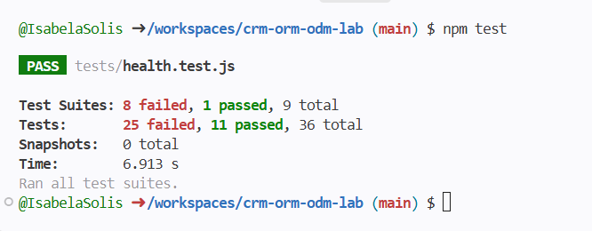

   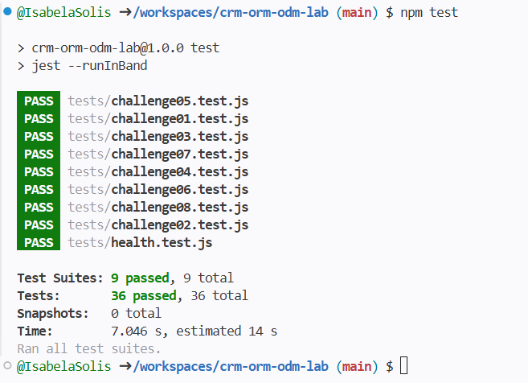

   ### Reto 1
   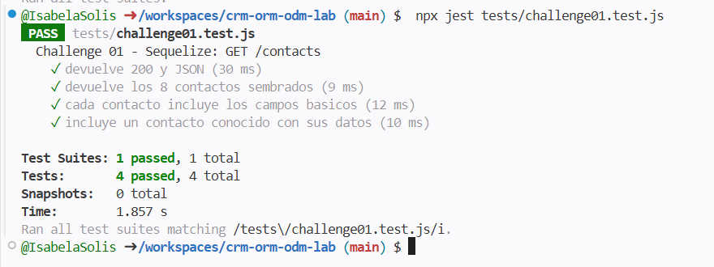
   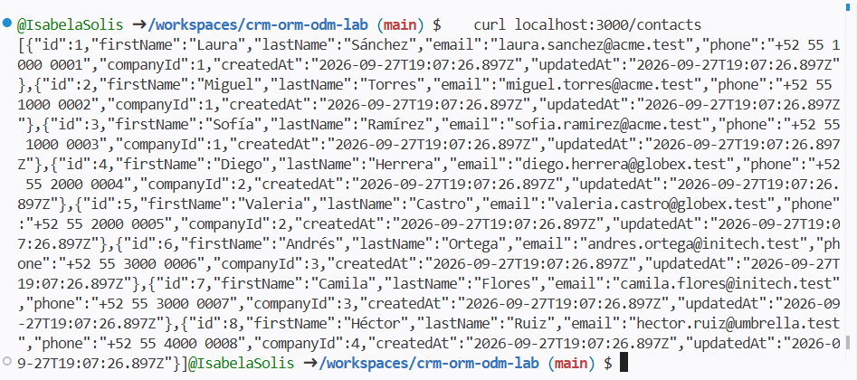

   ### Reto 2
   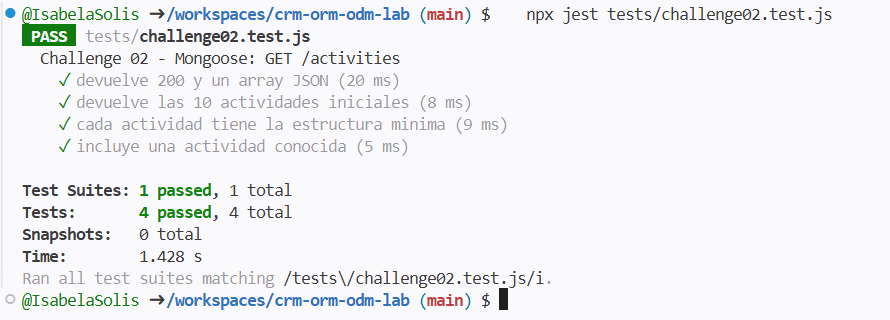
   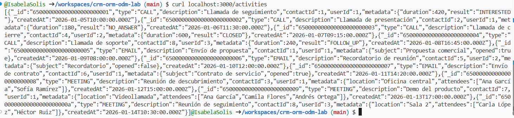

   ### Reto 3
   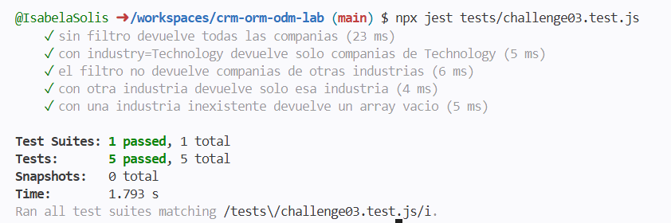
   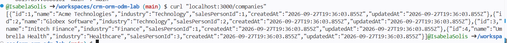
   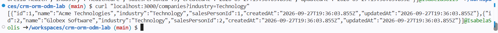
   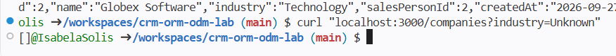

   ### Reto 4
   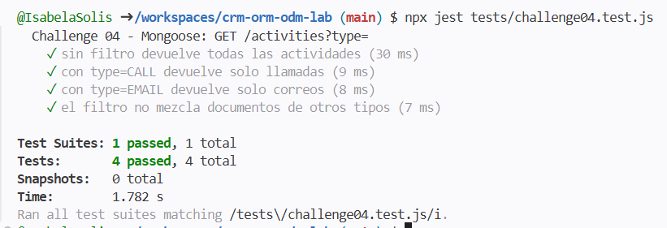
   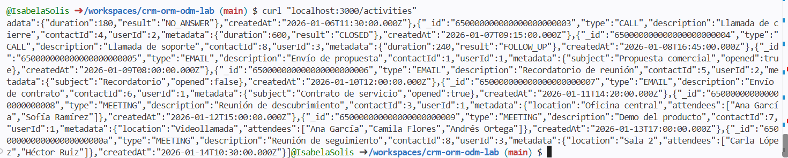
   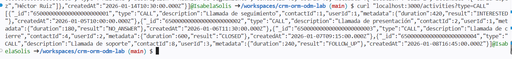
   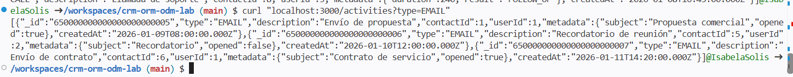

   ### Reto 5
   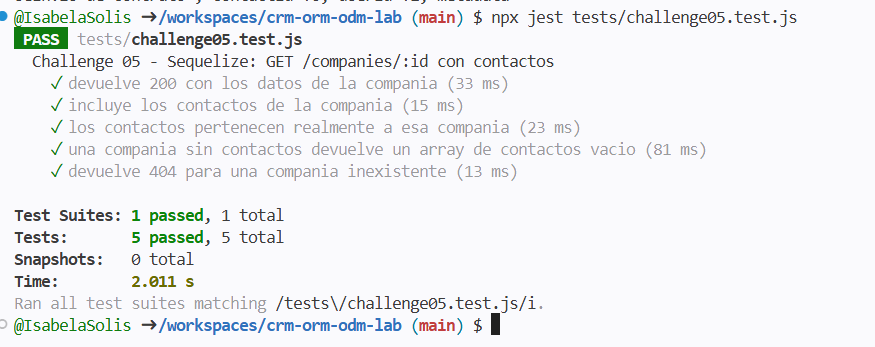
   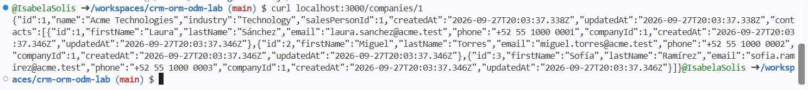

   ### Reto 6
   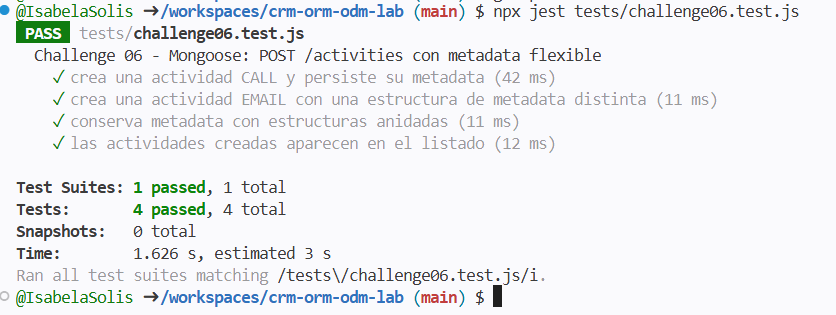
   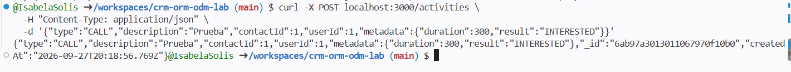

   ### Reto 7
   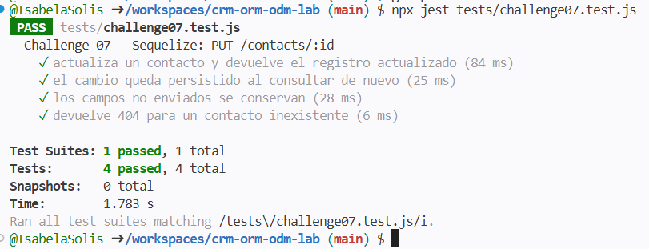
   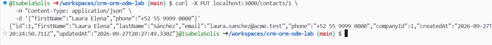

   ### Reto 8
   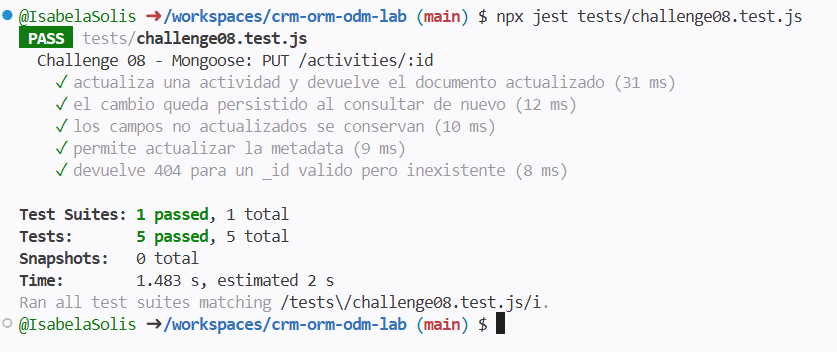
   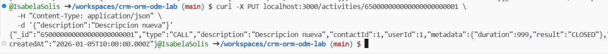
   
